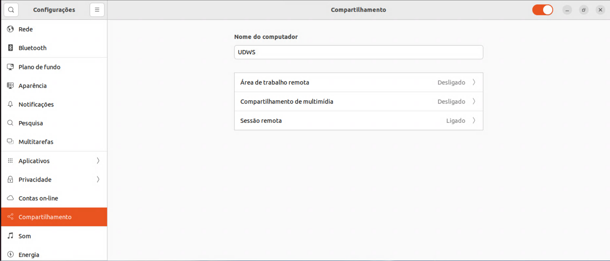
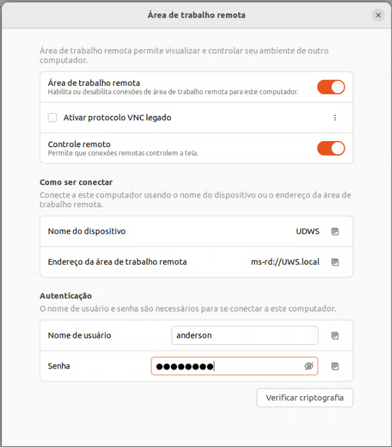

# Configurações

1. [Modelo](#1-modelo)
2. [SSH](#2-ssh)
3. [Docker](#3-docker)

## 1. Modelo

A Máquina utilizada para estudos é um Ubuntu 24.04

## 2. SSH

Para acesso ao ambiente será necessário a instalação de um servidor SSH, o mesmo não vem instalado por padrão na distribuição, realizaremos a atualização do sistema e instalação do ssh com os comandos:

```shell
sudo apt update && sudo apt upgrade -y && sudo apt install -y ssh
```

Além disso, para acesso através do protocolo RDP, habilitaremos essa função nas configurações do SO, conforme imagens abaixo:





## 3. Docker

O Docker é uma das ferramentas fundamentais que utilizaremos para estudos, portanto, é pertinente uma sessão específica de configuração dessa ferramenta no ambiente, siga o [tutorial](../docker/instalacao.md) para instalar o Docker.

## Ferramentas

Ferramentas utilizadas que não necessariamente estarão presentes nas distribuições padrão:

- ***net-tools*** - Suite de programas de redes que podem ser necessários

- ***Allow Locked Remote Desktop*** - Caso queira realizar um acesso remoto no computador usando o protocolo RDP, é necessário instalar o aplicativo "extensões" do gnome e integrar com o navegador para habilitar esse módulo
